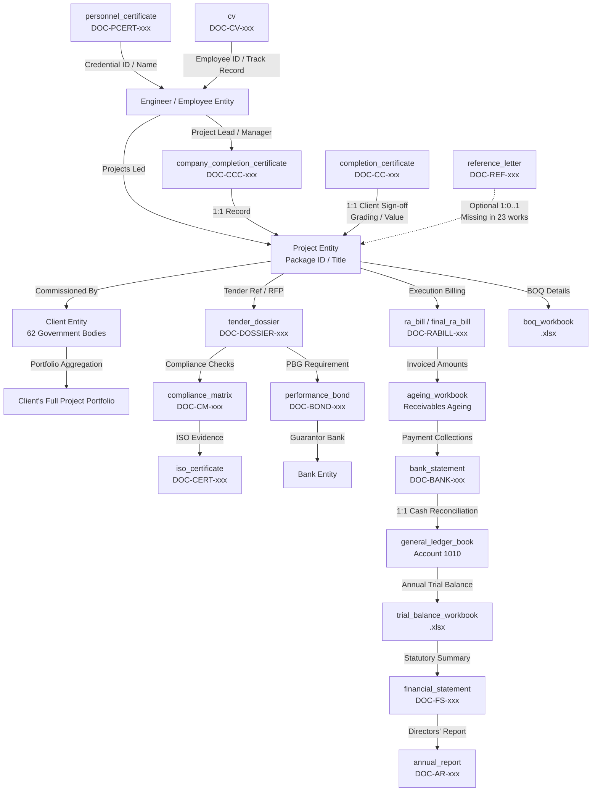

# Document Relationship Graph & Linkage Specification
**Corpus**: National Infrastructure Corp. Ltd. Enterprise Archive
**Scope**: Complete topology of cross-document entity linkages, foreign keys, transitive joins, weak links, and inference paths.

---

## 1. High-Level Entity & Document Architecture

In this enterprise estate, **no single document contains all facts**. Every bid calculation or audit question requires traversing a multi-hop graph connecting staff credentials, project assignments, client portfolios, financial journals, bank transactions, and commercial workbooks.

---

## 2. Exhaustive Linkage Directory

### Linkage 1: `personnel_certificate` ──▶ `Engineer` ──▶ `company_completion_certificate`
- **Join Key**: `Engineer Name` / `Employee ID`
- **Cardinality**: `1 : N` (One engineer holds credentials and manages multiple project packages)
- **Link Strength**: Strong (Exact name matching across PMI credentials and CCC project lead fields)
- **Traversal Purpose**: Resolves the temporal certification date (e.g. PMP issue date *2021-03-10*) and finds all projects executed by that engineer before or after certification.

### Linkage 2: `company_completion_certificate` ──▶ `Project` ──▶ `completion_certificate`
- **Join Key**: `Project Name` + `Package Number` (e.g. `Cable Stayed Bridge — Jharkhand Pkg-115`)
- **Cardinality**: `1 : 1` Exact Bijective Mapping across all 155 works.
- **Link Strength**: Deterministic.
- **Traversal Purpose**: Retrieves the client's qualitative performance grading (*Satisfactory*, *Good*, *Very Good*, *Excellent*, *Outstanding*) which only exists in the client's certificate.

### Linkage 3: `Project` ──▶ `Client` ──▶ `Client Portfolio`
- **Join Key**: Canonical `Client Name` (e.g. `Jal Nigam, Jharkhand`, `Public Works Department, Govt of Maharashtra`)
- **Cardinality**: `1 : N` (Each client has between 1 and 7 completed works in the estate).
- **Link Strength**: Strong (Once client organization names are normalized).
- **Traversal Purpose**: Core aggregation step for 80% of hackathon questions. The query identifies one project from an engineer, discovers the commissioning client, and aggregates over **all** projects owned by that client.

### Linkage 4: `Project` ──▶ `reference_letter` (Presence / Absence Link)
- **Join Key**: `Project Title` / `Package ID`
- **Cardinality**: `1 : 0..1` (132 projects have reference letters; **23 projects have NO reference letter**).
- **Link Strength**: Explicit link when present; **Negative Proof (Absence)** when missing.
- **Traversal Purpose**: Computes referenced shares (e.g. 33.33%, 66.67%) and answers missing document audit questions.

### Linkage 5: `Project` ──▶ `Tender / RFP` ──▶ `performance_bond`
- **Join Key**: `Tender Ref` (`RFP-132000xxx`)
- **Cardinality**: `1 : 1` (60 active performance bonds securing contract packages).
- **Link Strength**: Strong.
- **Traversal Purpose**: Reconciles bank guarantee values (typically 5% or 10% of contract value) and validates issuing bank relationships.

### Linkage 6: `ra_bill` / `final_ra_bill` ──▶ `ageing_workbook` ──▶ `bank_statement`
- **Join Key**: `Invoice No` (`AR-YYYY-xxxxx`)
- **Cardinality**: `1 : 1`
- **Link Strength**: Deterministic.
- **Traversal Purpose**: Tracks billed work vs actual payment collected, TDS deductions, and bank statement deposit entries.

### Linkage 7: `bank_statement` ──▶ `general_ledger_book` (Account 1010)
- **Join Key**: `Date` + `Amount` + `Narration / Particulars`
- **Cardinality**: `1 : 1` Exact Financial Reconciliation.
- **Link Strength**: Perfect Mathematical Equality.
- **Traversal Purpose**: Verifies cash movements, drawing down credit facilities, salary disbursements, and client receipt postings.

### Linkage 8: `general_ledger_book` ──▶ `trial_balance_workbook` ──▶ `financial_statement`
- **Join Key**: `Fiscal Year` + `Account Code` (1010, 2010, 3010, 4010, etc.)
- **Cardinality**: `N : 1`
- **Link Strength**: Deterministic aggregation.
- **Traversal Purpose**: Validates annual turnover, materials consumed, depreciation, and corporate P&L performance.

---

## 3. Weak Links, Inferred Links, and Ambiguity Resolutions

| Source Entity | Target Entity | Nature of Link | Risk / Ambiguity | Resolution Rule |
|---|---|---|---|---|
| `Engineer` | `Project` | Inferred in Client CC | Client CCs often do not name the internal Project Manager; only the Company CC (`DOC-CCC-xxx`) names the lead. | Always join via `company_completion_certificate` to establish the definitive Engineer-Project mapping. |
| `Client Acronym` | `Client Entity` | Weak / Alias Link | Different documents abbreviate client names (e.g. *PWD Maharashtra* vs *Public Works Department, Govt of Maharashtra*). | Use canonical client normalization table with fuzzy alias resolution. |
| `Contract Value` | `General Ledger` | Aggregate Link | Milestone billings are split across multiple RA bills over several fiscal years. | Sum all invoice entries under the client account in `Receivables_Ageing.xlsx` or filter GL revenue accounts by project narration. |
| `BOQ Items` | `Final RA Bill` | Hierarchical Link | Executed quantities in Final RA bills represent cumulative progress up to completion. | Read `Part ii — BoQ-wise Summary (as executed)` in `DOC-FINBILL-xxx`. |
