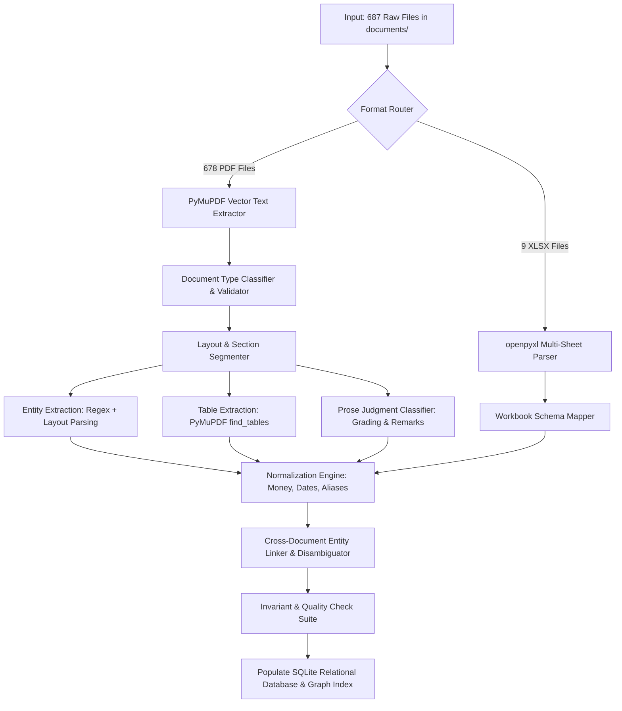

# End-to-End Extraction Pipeline Specification
**Corpus**: National Infrastructure Corp. Ltd. Enterprise Archive
**Objective**: Step-by-step extraction workflow from raw PDFs/XLSX to validated relational knowledge base.

---

## 1. Pipeline Architecture Flowchart

---

## 2. Detailed Execution Phases

### Phase 1: Ingestion & Document Routing
- Enumerate files via `document_index.csv`.
- Read file stream: `.pdf` -> `fitz.open()`; `.xlsx` -> `openpyxl.load_workbook()`.

### Phase 2: Structural Extraction
- Extract full text, text blocks with bounding boxes, font weights, and table bounding boxes.
- Extract structured tables from multi-page ledgers, bank statements, and BOQs.

### Phase 3: Field & Entity Extraction
- Extract standardized entity attributes: Project, Package ID, Client, Engineer, Value, Dates, Grading.
- Extract tabular rows for double-entry GL accounts, bank cash flows, asset registers, and aging debts.

### Phase 4: Normalization & Canonicalization
- Convert all monetary strings to exact integer INR.
- Convert all date strings to ISO 8601 `YYYY-MM-DD`.
- Map client aliases to canonical client IDs.

### Phase 5: Multi-Hop Entity Linking
- Join `completion_certificate` with `company_completion_certificate` on `(State, Package)`.
- Link `personnel_certificate` and `cv` to `company_completion_certificate` on `Project Lead`.
- Flag missing reference letters (`has_reference_letter = False`).

### Phase 6: Invariant Validation & DB Population
- Run 15 integrity checks (see QUALITY_CHECKS.md).
- Commit structured records to SQLite database.
