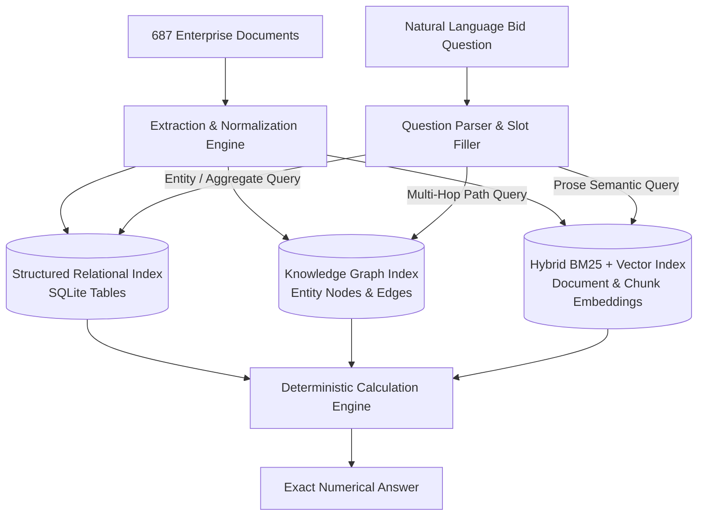

# Comprehensive Indexing & Query Retrieval Strategy
**Corpus**: National Infrastructure Corp. Ltd. Enterprise Estate
**Objective**: Blueprint for dual relational-graph and semantic indexing to achieve 100% deterministic retrieval across 687 documents.

---

## 1. The Dual-Index Architecture

Because questions require exact arithmetic over deterministic entity sets (e.g. "all works for client X", "all projects finished after date Y"), **a pure vector-based RAG architecture is fundamentally inadequate**.
The system must construct a **Dual-Index System**:
1. **Deterministic Relational / Knowledge Graph Index (SQLite / In-Memory NetworkX)**: Stores structured entity properties, foreign key links, exact integers, dates, and ratings.
2. **Dense Vector / BM25 Semantic Index**: Indexes unstructured prose clauses, executive summaries, tender specifications, and audit notes.

---

## 2. Relational Schema & Table Specifications

### Table 1: `projects`
- `project_id` (TEXT PRIMARY KEY, e.g. `JHARKHAND_PKG_115`)
- `title` (TEXT)
- `state` (TEXT)
- `package_number` (INTEGER)
- `category` (TEXT)
- `client_id` (TEXT FOREIGN KEY)
- `project_lead_id` (TEXT FOREIGN KEY)
- `contract_value_inr` (INTEGER)
- `completion_date` (TEXT ISO 8601)
- `performance_grading` (TEXT)
- `has_reference_letter` (BOOLEAN)
- `role` (TEXT)
- `company_cc_doc` (TEXT)
- `client_cc_doc` (TEXT)
- `reference_letter_doc` (TEXT)

### Table 2: `clients`
- `client_id` (TEXT PRIMARY KEY)
- `canonical_name` (TEXT)
- `category` (TEXT, State Dept / Municipal / Private)
- `total_works_count` (INTEGER)
- `total_portfolio_value_inr` (INTEGER)

### Table 3: `engineers`
- `engineer_id` (TEXT PRIMARY KEY)
- `full_name` (TEXT)
- `employee_id` (TEXT, e.g. `EMP-001`)
- `designation` (TEXT)
- `business_unit` (TEXT)
- `experience_years` (INTEGER)
- `cv_doc` (TEXT)

### Table 4: `credentials`
- `credential_id` (TEXT PRIMARY KEY, e.g. `PMI-200006`)
- `engineer_id` (TEXT FOREIGN KEY)
- `credential_type` (TEXT)
- `issue_date` (TEXT ISO 8601)
- `valid_through` (TEXT ISO 8601)
- `cert_doc` (TEXT)

### Table 5: `bonds`
- `bond_id` (TEXT PRIMARY KEY, e.g. `BND-00005`)
- `bank_name` (TEXT)
- `tender_ref` (TEXT)
- `issue_date` (TEXT ISO 8601)
- `guarantee_amount_inr` (INTEGER)
- `bond_doc` (TEXT)

---

## 3. Chunking & Embedding Strategy for Prose

- **Chunk Size**: Document-level (1–2 pages) for certificates and letters; Section-level (500 tokens, 50-token overlap) for Tender Dossiers and Annual Reports.
- **Metadata Tagging**: Every chunk must be enriched with `{doc_id, doc_type, project_id, client_id, engineer_id, date}`.
