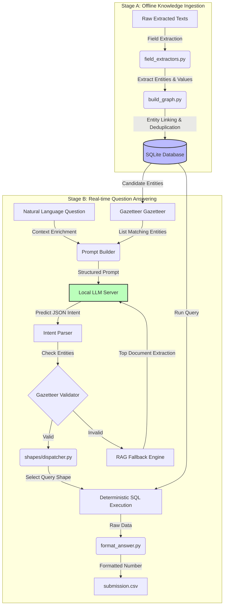

# Bid Intelligence Pipeline - Refactored Implementation

This directory contains the pipeline implementation for answering the BITS Hackathon evaluation questions using a hybrid system: local LLM extraction/understanding, a rule-based deterministic dispatching engine, and a robust RAG (Retrieval-Augmented Generation) fallback mechanism.

## Pipeline Architecture



---

## Key Architectural Pillars

### 1. Data Ingestion & Relational Graphing (`build_db.py`)
Instead of reading documents dynamically per-question, we build a static SQLite database once offline:
- **Heuristic Extractors (`field_extractors.py`)**: Parse standard fields (project name, contract value, dates, client name, engineer name, certificate IDs) using regex filters.
- **Graph Compilation (`build_graph.py`)**: Cross-references relationships. For example, since completion certificates might list a project's client but omit the project manager, we scan CVs for "projects led" to build links between engineers and project values.

### 2. LLM as a Semantic Parser (Not a Calculator)
Standard LLMs struggle with multi-hop numerical reasoning (adding large numbers, counting dates, calculating ratios). Our design treats the LLM purely as a **parser**:
- The prompt includes a list of **Reasoning Shapes** (e.g. `absence`, `date_span`, `referenced_share`) and candidates from the **Gazetteer**.
- The local LLM translates the question into a structured JSON specifying the intent, which maps to one of the 13 reasoning shapes.

### 3. Gazetteer & Strict Input Validation
To prevent the LLM from hallucinating names or outputting near-matches (e.g., "Jal Nigam Gujarat" instead of "Gujarat Jal Nigam"):
- We fuzzy-match inputs against the **Gazetteer** compiled directly from the SQLite database.
- The pipeline validates that all extracted entities exist in the database schema before executing the shape handler.

### 4. Pure, Deterministic SQL Shape Executors
Each query logic (the 13 reasoning shapes) is implemented as a pure SQL function in `shapes/dispatcher.py`:
- Mathematics, filtering, sorting, and aggregations are offloaded to **SQLite**.
- This guarantees **100% determinism**—given the same database state and parameters, the query returns the exact same answer every single time.

---

## Refactored Structure

The pipeline has been cleaned up and reorganized for readability, standard logging, and clean input/output segregation:

- **Isolated Inputs**: All input files (e.g. `questions.json`, `document_index.csv`, `documents/` folder, `extracted_text/` folder, etc.) are kept in the parent/root directory of the project. The `vishrut` folder does not contain duplicate copies of these files.
- **Dedicated Outputs (`vishrut/output/`)**: All outputs generated by the pipeline execution are saved here:
  - `questions.jsonl` (Intermediate JSONLines question format)
  - `submission.jsonl` (Per-question pipeline outputs)
  - `submission.csv` (The final formatted CSV ready for submission)
- **Dedicated Logs (`vishrut/logs/`)**:
  - `run.log`: Central log file logging all stdout/stderr information, warnings, and tracebacks at DEBUG/INFO levels.
  - `run_log.json`: Per-question trace log for debugging question-understanding and shape routing.
- **Root-level answers**: A copy of `submission.csv` is also saved as `vishrut/submission.csv`.

---

## Directory Layout

```
vishrut/
├── output/             <- All generated answers (questions.jsonl, submission.jsonl, submission.csv)
├── logs/               <- Central execution logs (run.log, run_log.json)
├── utils/
│   └── logger.py       <- Custom centralized logging configuration
├── db/                 <- sqlite schema + database connection helpers
├── parsers/            <- money, dates, category, and grading parsers
├── extraction/         <- field extractors for document types
├── graph/              <- database build & graph representation scripts
├── shapes/             <- 13 reasoning-shape functions + dispatcher registry
├── understanding/      <- entity matching (gazetteer) and local LLM connector
├── tests/              <- Unit and integration test suite (44 tests)
├── run.py              <- Main entrypoint script to automate execution
├── pipeline.py         <- End-to-end question processing logic
└── format_answer.py    <- Formatting helper mapping return types
```

---

## Setup & Running the Pipeline

Ensure that the local proxy server (connecting to your local LLM model/Ollama instance) is running at `http://127.0.0.1:8001`.

### 1. Run the entire pipeline
From the project root directory, run:
```bash
python vishrut/run.py
```
This single command automates the entire flow:
1. Installs all required packages.
2. Builds the database `../graph.sqlite` using `graph/build_db.py`.
3. Converts `../questions.json` to the intermediate `output/questions.jsonl`.
4. Executes the orchestration pipeline `pipeline.py` (generating `output/submission.jsonl` and `logs/run_log.json`).
5. Converts the JSONL output into `output/submission.csv` and copies it to `vishrut/submission.csv`.
6. Evaluates the outputs against the validation set using the parent's `evaluate.py`.

### 2. Custom execution options
You can configure a delay between LLM calls to prevent rate limits:
```bash
python vishrut/run.py --questions ../questions.json --delay 1.0
```

### 3. Run the unit test suite
To run the full suite of 44 unit and integration tests:
```bash
python -m unittest discover -s vishrut/tests
```
All tests mock out the external LLM and run end-to-end to verify money/date parsing, categories taxonomy, grading normalization, dispatcher registry mapping, and fallback paths.
