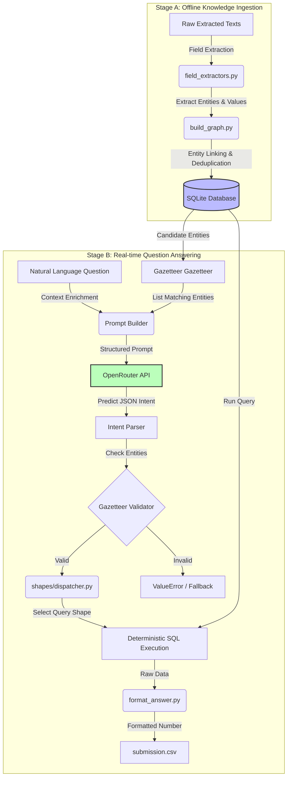

# BITS Hackathon Approach: Bid Intelligence Pipeline

This document outlines our deterministic, hybrid LLM + relational SQL approach to solve bid intelligence questions on a synthetic construction document estate.

## Pipeline Architecture



## Key Architectural Pillars

### 1. Data Ingestion & Relational Graphing (`build_db.py`)
Instead of reading documents dynamically per-question, we build a static SQLite database once offline:
- **Heuristic Extractors (`field_extractors.py`)**: Parse standard fields (project name, contract value, dates, client name, engineer name, certificate IDs) using regex filters.
- **Graph Compilation (`build_graph.py`)**: Cross-references relationships. For example, since completion certificates might list a project's client but omit the project manager, we scan CVs for "projects led" to build links between engineers and project values.

### 2. LLM as a Semantic Parser (Not a Calculator)
Standard LLMs struggle with multi-hop numerical reasoning (adding large numbers, counting dates, calculating ratios). Our design treats the LLM purely as a **parser**:
- The prompt includes a list of **Reasoning Shapes** (e.g. `absence`, `date_span`, `referenced_share`) and candidates from the **Gazetteer**.
- OpenRouter translates the question into a structured JSON specifying:
  ```json
  {
    "shape": "absence",
    "client_name": "Jal Nigam, Jharkhand",
    "engineer_name": null,
    "project_name": null
  }
  ```

### 3. Gazetteer & Strict Input Validation
To prevent the LLM from hallucinating names or outputting near-matches (e.g., "Jal Nigam Jharkhand" instead of "Jal Nigam, Jharkhand"):
- We fuzzy-match inputs against the **Gazetteer** compiled directly from the SQLite database.
- The pipeline validates that all extracted entities exist in the database schema before executing the shape handler.

### 4. Pure, Deterministic SQL Shape Executors
Each query logic (the 13 reasoning shapes) is implemented as a pure SQL function in `shapes/dispatcher.py`:
- Mathematics, filtering, sorting, and aggregations are offloaded to **SQLite**.
- This guarantees **100% determinism**—given the same database state and parameters, the query returns the exact same answer every single time.
